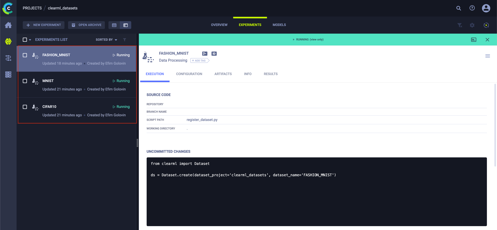
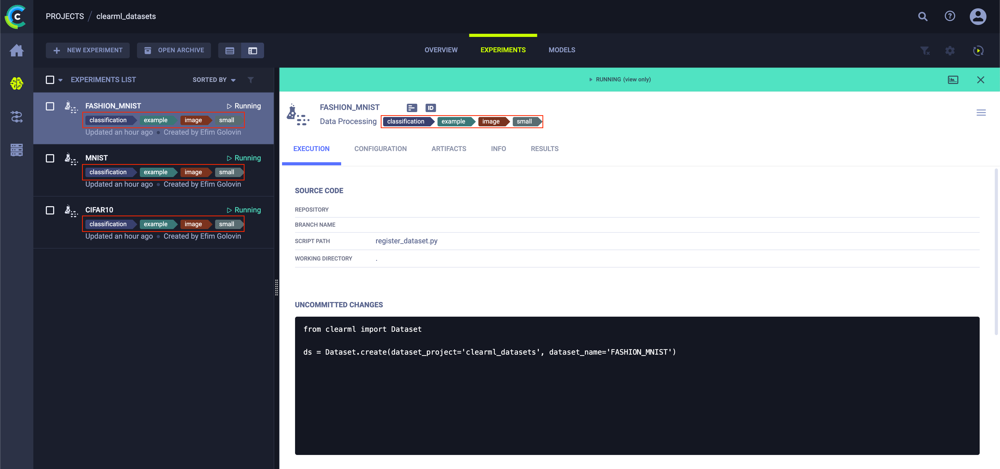

# ClearML Datasets

## Introduction

This is a toy example of the project with image datasets stored under ClearML platform.

It contains some of the most popular datasets, namely:
- CIDFAR10;
- MNIST;
- Fashion MNIST.
- etc (#todo: add more datasets).

Each package contains the code which:
- Creates a new Dataset entity;
- Uploads data to your dataset;
- Adds some meta-info about your Dataset;
- Creates a new version of the previous Dataset entity;
- Compares Datasets.

## Local environment setup

This section describes steps needed to create a local environment where you can start to work with code.

### Step 0: Enter the repository page

[Here](https://github.com/IooHooI/clearml_datasets) is the link to the respective repository on GitHub.

### Step 1: Cone the repository

```shell
git clone https://github.com/IooHooI/clearml_datasets.git
```

### Step 2: Enter the root repository folder

```shell
cd clearml_datasets
```

### Step 3: Create a conda environment from environment.yaml file

```shell
conda create python=3.8 --file environment.yaml
```

### Step 4: Activate an environment

```shell
conda activate clearml_datasets
```

### Step 5: Check Clearml CLI connection with Clearml Server

Run the command below:
```shell
clearml-init
```

If the output looks SOMETHING like this:

```shell
ClearML SDK setup process
Configuration file already exists: <HOME DIRECTORY>/clearml.conf
Leaving setup, feel free to edit the configuration file.
```

Then it means that CLI configuration was done earlier.

Please, **MAKE SURE** that this `clearml.conf` file is pointed to the right Clearml Server
(i.e., check app/api/files endpoints and credentials).

Otherwise, you should follow the official CLI setup
[documentation](https://clear.ml/docs/latest/docs/getting_started/ds/ds_first_steps#connect-clearml-sdk-to-the-server).

### Step 6: Check Datasets in clearml_datasets project

Type the following command in the terminal:

```shell
clearml-data search --project clearml_datasets
```

You should see something like this:

```shell
clearml-data - Dataset Management & Versioning CLI
Search datasets
project          | name                             | tags                | created             | id                              
----------------------------------------------------------------------------------------------------------------------------------
```

## How To...

This section gives an overview of what (and how) you can do with your datasets.

Below are steps with more detailed description of code snippets/commands/etc.

### Create a new Dataset entity

This section describes how to create a new dataset in ClearML Server.
Essentially, a dataset in ClearML Server is just an experiment with the type `"data_processing"`.

However, there is a separate part of ClearML SDK which gives all functionality necessary 
to work with these experiments as with datasets.

#### CIFAR10

Here is the [link](https://github.com/IooHooI/clearml_datasets/blob/main/cifar10/dataset_1_creation.py)
to the script with dataset creation.

Here is how you can execute the script:

```shell
python cifar10/dataset_1_creation.py
```

After script execution you should see something like this:

```shell
{'name': 'CIFAR10', 'created': datetime.datetime(2022, 6, 21, 11, 11, 30, 448000, tzinfo=tzutc()), 'project': 'clearml_datasets', 'id': 'efb893860f554d459bfdf5775c7297ac', 'tags': []}
```

#### MNIST

Here is the [link](https://github.com/IooHooI/clearml_datasets/blob/main/mnist/dataset_1_creation.py)
to the script with dataset creation.

Here is how you can execute the script:

```shell
python mnist/dataset_1_creation.py
```

After script execution you should see something like this:

```shell
{'name': 'CIFAR10', 'created': datetime.datetime(2022, 6, 21, 11, 11, 30, 448000, tzinfo=tzutc()), 'project': 'clearml_datasets', 'id': 'efb893860f554d459bfdf5775c7297ac', 'tags': []}
{'name': 'MNIST', 'created': datetime.datetime(2022, 6, 21, 11, 11, 49, 844000, tzinfo=tzutc()), 'project': 'clearml_datasets', 'id': '1427074363534735ba938cbce11d67a4', 'tags': []}
```

#### Fashion MNIST

Here is the [link](https://github.com/IooHooI/clearml_datasets/blob/main/fashion_mnist/dataset_1_creation.py)
to the script with dataset creation.

Here is how you can execute the script:

```shell
python fashion_mnist/dataset_1_creation.py
```

After script execution you should see something like this:

```shell
{'name': 'CIFAR10', 'created': datetime.datetime(2022, 6, 21, 11, 11, 30, 448000, tzinfo=tzutc()), 'project': 'clearml_datasets', 'id': 'efb893860f554d459bfdf5775c7297ac', 'tags': []}
{'name': 'MNIST', 'created': datetime.datetime(2022, 6, 21, 11, 11, 49, 844000, tzinfo=tzutc()), 'project': 'clearml_datasets', 'id': '1427074363534735ba938cbce11d67a4', 'tags': []}
{'name': 'FASHION_MNIST', 'created': datetime.datetime(2022, 6, 21, 11, 14, 21, 182000, tzinfo=tzutc()), 'project': 'clearml_datasets', 'id': '9bec6260e7694a329a21664f8441ff53', 'tags': []}
```

After these steps are executed your datasets should look like this:



### Add some meta-info about your Dataset

This section describes how to add some meta-info about your dataset.

Example: tags (but not only).

Later we also show how to calculate and store some descriptive statistics in your dataset.

#### CIFAR10

Here is the [link](https://github.com/IooHooI/clearml_datasets/blob/main/cifar10/dataset_2_meta_info_preparation.py)
to the script with dataset meta-info creation.

Here is how you can execute the script:

```shell
python cifar10/dataset_2_meta_info_preparation.py
```

After script execution you should see something like this:

```shell
{'name': 'CIFAR10', 'created': datetime.datetime(2022, 6, 21, 11, 11, 30, 448000, tzinfo=tzutc()), 'project': 'clearml_datasets', 'id': 'efb893860f554d459bfdf5775c7297ac', 'tags': ['classification', 'example', 'image', 'small']}
{'name': 'MNIST', 'created': datetime.datetime(2022, 6, 21, 11, 11, 49, 844000, tzinfo=tzutc()), 'project': 'clearml_datasets', 'id': '1427074363534735ba938cbce11d67a4', 'tags': []}
{'name': 'FASHION_MNIST', 'created': datetime.datetime(2022, 6, 21, 11, 14, 21, 182000, tzinfo=tzutc()), 'project': 'clearml_datasets', 'id': '9bec6260e7694a329a21664f8441ff53', 'tags': []}
```

Please take a closer look at tags that were added to the respective dataset.

#### MNIST

Here is the [link](https://github.com/IooHooI/clearml_datasets/blob/main/mnist/dataset_2_meta_info_preparation.py)
to the script with dataset meta-info creation.

Here is how you can execute the script:

```shell
python mnist/dataset_2_meta_info_preparation.py
```

After script execution you should see something like this:

```shell
{'name': 'CIFAR10', 'created': datetime.datetime(2022, 6, 21, 11, 11, 30, 448000, tzinfo=tzutc()), 'project': 'clearml_datasets', 'id': 'efb893860f554d459bfdf5775c7297ac', 'tags': ['classification', 'example', 'image', 'small']}
{'name': 'MNIST', 'created': datetime.datetime(2022, 6, 21, 11, 11, 49, 844000, tzinfo=tzutc()), 'project': 'clearml_datasets', 'id': '1427074363534735ba938cbce11d67a4', 'tags': ['classification', 'example', 'image', 'small']}
{'name': 'FASHION_MNIST', 'created': datetime.datetime(2022, 6, 21, 11, 14, 21, 182000, tzinfo=tzutc()), 'project': 'clearml_datasets', 'id': '9bec6260e7694a329a21664f8441ff53', 'tags': []}
```

Please take a closer look at tags that were added to the respective dataset.

#### Fashion MNIST

Here is the [link](https://github.com/IooHooI/clearml_datasets/blob/main/fashion_mnist/dataset_2_meta_info_preparation.py)
to the script with dataset meta-info creation.

Here is how you can execute the script:

```shell
python fashion_mnist/dataset_2_meta_info_preparation.py
```

After script execution you should see something like this:

```shell
{'name': 'CIFAR10', 'created': datetime.datetime(2022, 6, 21, 11, 11, 30, 448000, tzinfo=tzutc()), 'project': 'clearml_datasets', 'id': 'efb893860f554d459bfdf5775c7297ac', 'tags': ['classification', 'example', 'image', 'small']}
{'name': 'MNIST', 'created': datetime.datetime(2022, 6, 21, 11, 11, 49, 844000, tzinfo=tzutc()), 'project': 'clearml_datasets', 'id': '1427074363534735ba938cbce11d67a4', 'tags': ['classification', 'example', 'image', 'small']}
{'name': 'FASHION_MNIST', 'created': datetime.datetime(2022, 6, 21, 11, 14, 21, 182000, tzinfo=tzutc()), 'project': 'clearml_datasets', 'id': '9bec6260e7694a329a21664f8441ff53', 'tags': ['classification', 'example', 'image', 'small']}
```

Please take a closer look at tags that were added to the respective dataset.

After these steps are executed your datasets should look like this:



Of course these tags can be used to filter datasets you need.

### Upload data to your dataset

This section describes how to upload actual data to your dataset.

As in other tools/frameworks, a dataset is just an entity which holds some meta-info about your data.

But you should also actually store your data somewhere.

There are tonnes of data storage options: S3, Azure Blob Storage, Google Storage, FTP Server, HDFS etc.

In this case we have a File Server - the storage component of ClearML Server.

But we can also configure ClearML Server to work with S3/Azure Blob Storage/Google Storage instead of File Server.

#### CIFAR10

Here is the [link](https://github.com/IooHooI/clearml_datasets/blob/main/cifar10/dataset_3_data_preparation.py)
to the script with actual data uploading.

[TBD]

#### MNIST

Here is the [link](https://github.com/IooHooI/clearml_datasets/blob/main/mnist/dataset_3_data_preparation.py)
to the script with actual data uploading.

[TBD]

#### Fashion MNIST

Here is the [link](https://github.com/IooHooI/clearml_datasets/blob/main/fashion_mnist/dataset_3_data_preparation.py)
to the script with actual data uploading.

[TBD]

### Create a new version of the previous Dataset entity

[TBD]

#### CIFAR10

[TBD]

#### MNIST

[TBD]

#### Fashion MNIST

[TBD]

### Compare Datasets

[TBD]

#### CIFAR10

[TBD]

#### MNIST

[TBD]

#### Fashion MNIST

[TBD]
